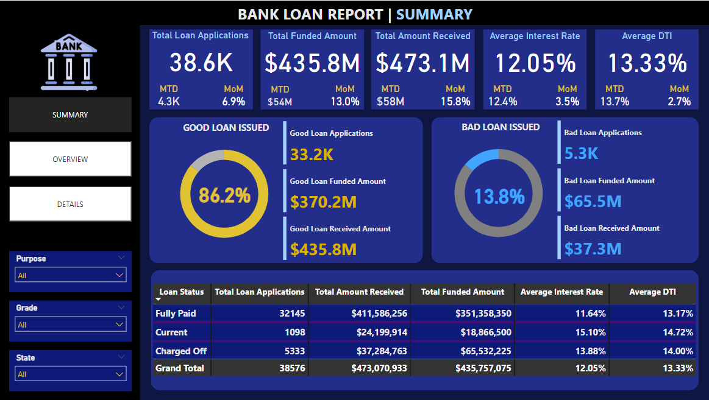
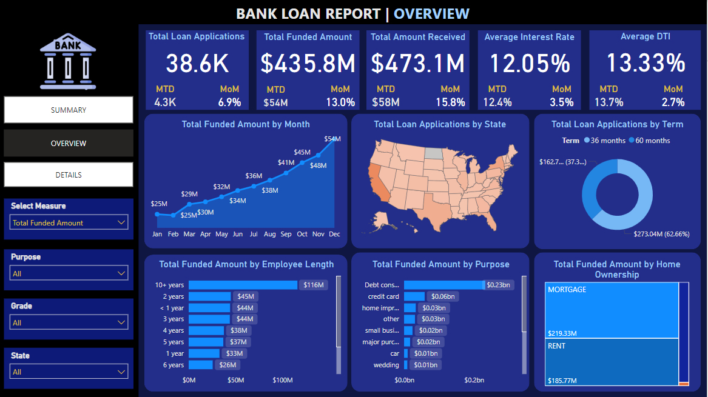
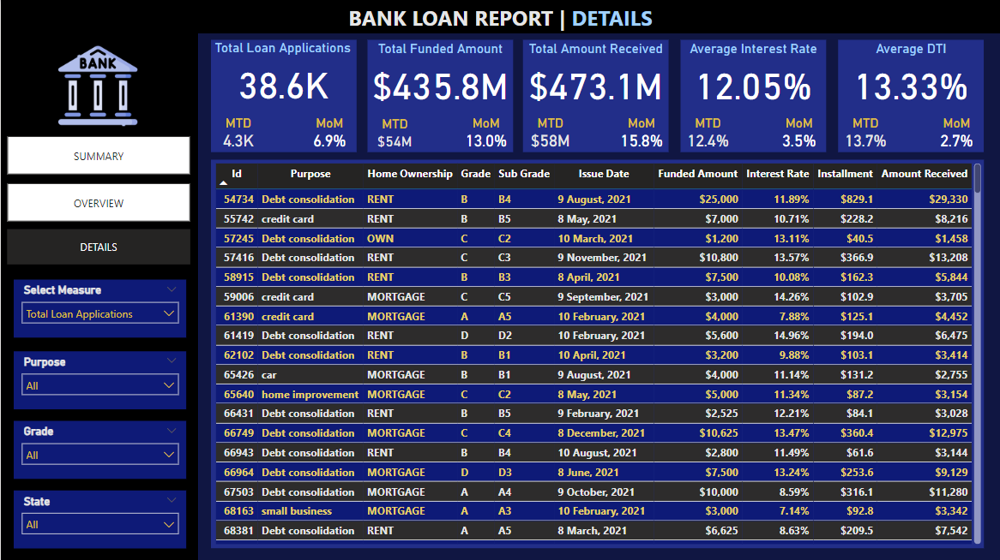

# BANK_LOAN_ANALYSIS_USING_POWER-BI_AND_MS-SQL
This repository contains a comprehensive Bank Loan Analysis report developed using **Power BI** and **MS SQL**. The report offers in-depth insights into loan applications, disbursements, repayment trends, and various other performance indicators. It is designed to assist financial institutions in making data-driven decisions regarding their lending operations.

## Report Overview

The Bank Loan Analysis report focuses on:

- **Loan Application Trends**: Monthly, regional, and purpose-based loan trends.
- **Performance Metrics**: Key KPIs such as total loans, funded amounts, and repayments.
- **Good Loan vs. Bad Loan Analysis**: Understanding performance based on loan statuses.
- **Demographic Insights**: Borrower characteristics like employment length and home ownership.

## Key Features

1. **Interactive Visualizations**:
   - **Monthly Trends by Issue Date** (Line Chart)
   - **Regional Analysis by State** (Filled Map)
   - **Loan Term Distribution** (Donut Chart)
   - **Employment Length Analysis** (Bar Chart)
   - **Loan Purpose Breakdown** (Bar Chart)
   - **Home Ownership Analysis** (Tree Map)

2. **KPI Dashboards**:
   - **Total Loan Applications**
   - **Total Funded Amount**
   - **Total Amount Received**
   - **Average Interest Rate**
   - **Average Debt-to-Income Ratio (DTI)**

3. **Grid View Report**: Comprehensive metrics categorized by loan status, enabling detailed performance monitoring.

4. **Dynamic Data Queries**: SQL queries for extracting, transforming, and loading (ETL) data into the report.

## Key SQL Queries

Some of the SQL queries used in the report include:

- **Total Loan Applications**:
  ```sql
  SELECT COUNT(id) AS Total_Loan_Application FROM bank_loan_data;
  ```

- **MTD Loan Applications**:
  ```sql
  SELECT COUNT(id) AS MTD_Total_Loan_Application FROM bank_loan_data
  WHERE MONTH(issue_date) = 12 AND YEAR(issue_date) = 2021;
  ```

- **Good Loan Percentage**:
  ```sql
  SELECT (COUNT(CASE WHEN loan_status = 'Fully Paid' OR loan_status = 'Current' THEN id END) * 100) / COUNT(id) AS Good_Loan_Percentage FROM bank_loan_data;
  ```

- **Regional Analysis by State**:
  ```sql
  SELECT address_state, COUNT(id) AS Total_Loan_Applications, SUM(loan_amount) AS Total_Funded_Amount
  FROM bank_loan_data
  GROUP BY address_state
  ORDER BY COUNT(id) DESC;
  ```

## Screenshots

Below are previews of the report:







## How to Use This Report

1. Clone the repository:
   ```bash
   git clone https://github.com/yourusername/bank-loan-analysis.git
   ```

2. Open the Power BI file `Bank_Loan_Analysis.pbix` using [Power BI Desktop](https://powerbi.microsoft.com/).

3. Use the provided SQL queries to update the database views or load new data.

4. Explore the visuals and dashboards for actionable insights.

## About the Dataset

The dataset includes anonymized data points such as:

- Loan amounts and repayment details.
- Borrower demographics (employment, home ownership).
- Loan purpose and terms.

> Ensure compliance with relevant data protection regulations when working with sensitive data.
